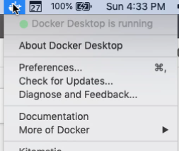
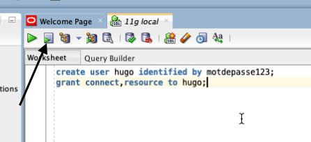

[Playlist Youtube pour l'instllation](https://www.youtube.com/playlist?list=PLliSmgNDYPxyO0qZ0yefbOHA5TbhDMOkj)

# Installation de Docker

Vous pouvez suivre la documentation d'installation en anglais au [lien suivant](https://docs.docker.com/docker-for-mac/install/).

Téléchargez l'application Docker du [lien suivant](https://download.docker.com/mac/stable/Docker.dmg) et installez là dans votre dossier d'application.

À sa première exécution, docker va demander d'installer ses outils. Votre mot de passe d'administrateur sera nécéssaire.


Docker est prêt quand son icône n'est plus animé, vous pouvez aussi regarder son état en cliquant sur l'icône.



# Installation de SQL Developer

SQL Developer est disponible au [lien suivant](https://www.oracle.com/technetwork/developer-tools/sql-developer/downloads/index.html).

Faire attention, la version de java JDK8 d'Oracle doit être installée avant de pouvoir utiliser SQL Developer. Ci ce n'est pas déjà installé, vous pouvez vous le procurer [sur le site d'Oracle](http://www.oracle.com/technetwork/java/javase/downloads/jdk8-downloads-2133151.html).

Une fois téléchargé, copiez l'application dans votre dossier d'Application.

# Installation de la base de données Oracle 11g sur Docker

Ouvrez le terminal et exécutez la commande suivante:
```
docker run --name oracle11g -d -p 1521:1521 wnameless/oracle-xe-11g
```

Cela va installer et configurer la base de données sur votre système.

# Connexion et création d'un utilisateur avec SQL Developer

Il faut faire une première connexion avec le compte `system` pour se créer un utilisateur normal sur notre base de données.

Ouvrez SQL Developer et créez une nouvelle connexion.


Entrez les informations suivantes :
```
Connection name : À votre choix
Username : system
Password : oracle
```


Appuyez sur `connect` pour se connecter à la base de données.

La première connexion avec le compte système sera temporaire pour créer le compte utilisateur normal.

Avec la connexion établie, vous serez accueilli par la fenêtre de script à envoyer à notre base de données. Nous l'utiliserons pour ajouter un nouvel utilisateur.

```SQL
create user nomUsager identified by monMotDePasse;
grant connect, resource to nomUsager;
```

Où le `nomUsager` et `monMotDePasse` est de votre propre crue.



Exécutez le script en cliquant sur le bouton `Run script` ou pesez sur F5.

Si tout a bien été, la fenêtre d'affichage de script nous indique que le compte est créé et que les accès sont accordés.


Avec la création de notre compte, nous allons modifier les informations d'accès pour nous connecter à partir de notre compte à l'instar du compte system.

Avec un clic droit sur le serveur, changez les `properties` qui nous ramène aux informations de connexions. Nous allons changer les informations pour le nouveau compte créé.


Avec cela, nous pouvons nous connecter et utiliser la base de données sur macOS.

# Fermeture et réouverture de la base de données
Vous pouvez quitter Docker à partir de la barre de menu pour fermer la base de données quand elle n'est pas utilisée.

Pour repartir la base de données :

* Relancer l'application Docker et attendre qu'elle soit initialisée (pas d'animation dans l'icône)
* Ouvrir le terminal et tapez la commande suivante :
```
docker start oracle11g
```

La base de données sera prête pour utilisation et vous pourrez vous connecter à celle-ci à partir de SQL Developer.
